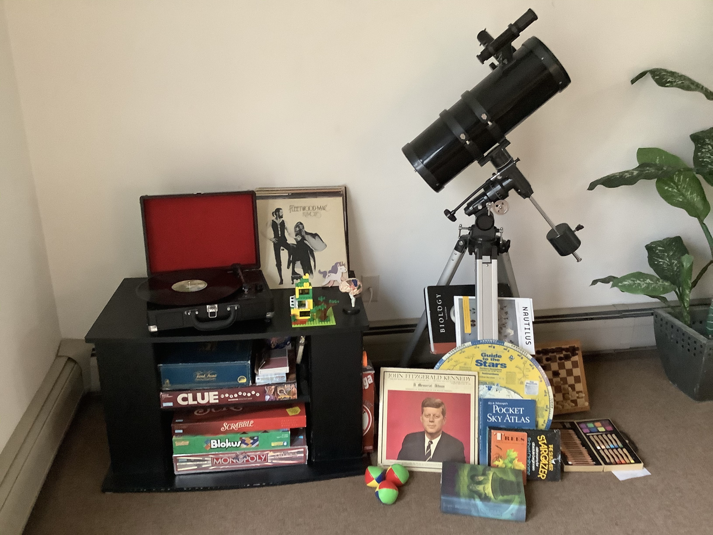

# Cajita 2019

### Mimi: Seymour Glass, a wooden bear, & getting spoiled rotten
  - The most sympathetic stuffed dog in the world & his wooden bear comforted my Mimi when she needed it most
  - Mimi used to hand sew my halloween costumes: a felt pumpkin & Bugs Bunny with stuffed carrots. She kept me stocked on twizzlers
  - She taught me unconditional love, kindness to strangers, and how to stand up for yourself
    
### Mom: Family, her notes, & loving with your whole heart
  - My mom never failed to be there for my sister and I when we were growing up -- everything she did was to keep us happy and healthy
  - My mom writes little notes to me just about every time I visit home -- only _sometimes_ they take the form of a to-do
  - She embodies what it means to love with your whole heart

### Dad: Golf, juggling & the value of friendship
  - My dad's favorite place was the golf course. He knew everyone's name and always greeted them with a hand shake and a laugh
  - I remember watching, completely mesmerized, as my dad juggled beanie babies when I was a kid
  - He had many life-long friends and an amazing family

### Margaret: HP, the joys of childhood, & having someone on your team 
  - Always there to cheer me on and keep me up to date on the latest HP & Bernie memorabilia
  - My sister is one of the nicest people to walk this green earth. I am lucky to have her by my side
  - Forever a shoulder to lean on and an ear to listen

### Science, curiosity, & who I wanna be when I grow up
  - I know I'd like to be forever curious and perpetually learning. I'd like to work with others and teach
  - I don't yet know what kind of path that will take
  - But I do know the kind of person that I would like to be. Thanks to the people that I am lucky to call friends and family
  
# Cajita 2020

### Math & Teaching: The joys of sharing knowledge
  - I remember in sixth grade hanging out in backyard with my mom. I was chucking a bunch of golfballs to teach her the difference between mean, median, & mode.
  - She had to pass a teaching certification exam and she was struggling with math.
  - I used to spend hours re-telling my mom all the plot lines from Harry Potter -- covering every twist and turn. These lectures were probably longer than listening to the audiobook.
  
### Stars & Trees: Discovering my place in the world
  - My dad used to walk around with my sister & me. He would point out trees when we were in the woods and at night he'd point out constellations.
  - This turned my perspective out towards the natural world.
  - I have always loved looking at the moon and planets and stars. 

### History & Politics: Finding shared interest
  - My sister is a big history buff and she has always had an interest in politics. She's a big fan of JFK.
  - Her interest has brought me into it and now we always talk about politics and staying up to date on the news.

### Legos & Play-doh: Creating and playing just for the sake of it
  - My sister & I used to spend a few hours making things with Lego's, playing with play-doh, and drawing with my grandmother.

